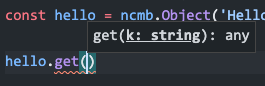
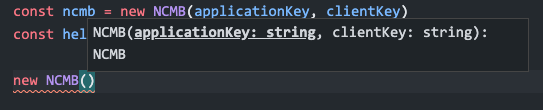

# NCMB SDK for deno & TypeScript

denoでNCMB（ニフクラ mobile backend）を使うためのSDKです。非公式ライブラリになります。Node.js × TypeScript環境でも動作します。

[mBaaSでサーバー開発不要！ | ニフクラ mobile backend](https://mbaas.nifcloud.com/)

## 使い方

denoをインストールします。

[Deno](https://deno.land/)

### サンプルコード

オブジェクトを保存するコードです。 `test.ts` として保存してください。

```js
import NCMB, { NCMBObject, NCMBQuery, NCMBInstallation, NCMBUser } from 'https://raw.githubusercontent.com/goofmint/ncmb_deno/master/deno/ncmb.ts'

// 初期化
new NCMB('YOUR_APPLICATION_KEY', 'YOUR_CLIENT_KEY')

// オブジェクト作成
const hello = new NCMBObject('HelloDeno')

// 値を設定して保存
await hello
- .set('message', 'Hello world')
- .set('number', 100)
- .save()

// 保存できていればオブジェクトIDが出力されます
console.log(hello.get('objectId'))

// ACLの使い方
const acl = new NCMBAcl()
acl
- .setPublicReadAccess(true)
- .setPublicWriteAccess(false)
const hello2 = new NCMBObject('HelloDeno')
await hello2
- .set('message', 'Hello world')
- .set('number', 100)
- .set('acl', acl) 
- .save()
```

#### ACLについて

ACLは次のメソッドがあります。

- setPublicReadAccess(bol: boolean): NCMBAcl
- setPublicWriteAccess(bol: boolean): NCMBAcl
- setUserReadAccess(user: NCMBUser, bol: boolean): NCMBAcl
- setUserWriteAccess(user: NCMBUser, bol: boolean): NCMBAcl
- setRoleReadAccess(role: string, bol: boolean): NCMBAcl
- setRoleWriteAccess(role: string, bol: boolean): NCMBAcl

### 実行

**Denoの場合**

`--allow-net` は必須です。 `--allow-read` は設定ファイルを読み込む際に必須です。

```
deno run --allow-net --allow-read test.ts
```

## Node.js × TypeScriptの場合

### インストール

npmなどで行います。

```
npm install ncmb_ts -S
```

基本的に使い方は変わりませんが、ルートでのasync/awaitはサポートされていないので注意してください。

```ts
import { NCMB, NCMBObject, NCMBQuery, NCMBInstallation, NCMBUser } from 'ncmb_ts'

const ncmb = new NCMB('YOUR_APPLICATION_KEY', 'YOUR_CLIENT_KEY')
const hello = new NCMBObject('HelloDeno');

(async () =>  {
  await hello
    .set('message', 'Hello world')
    .set('number', 100)
    .save()
  console.log(hello.get('objectId'))

  await hello
    .set('number', 200)
    .save()

  console.log(hello.get('number'))

  const query = ncmb.Query('HelloDeno')
  query.equalTo('objectId', 'ypk03ZHeJxjSnSM1')
  query.limit(1)
  const results = await query.fetchAll()
  console.log(results)
})();
```

VS Codeなどで入力補完が使えます。





### データストア

#### 検索

```js
const query = new NCMBQuery('QueryTest');
const results = await query.in('array', ['c']).fetchAll()
console.log(results.length)
console.log(results[0].get('objectId'))
```

**利用できるオペランド**

- equalTo(key: string, value:any): NCMBQuery
- setOperand(key: string, value:any, ope: string|null): NCMBQuery
- notEqualTo(key: string, value:any): NCMBQuery
- lessThan(key: string, value: number | Date): NCMBQuery
- lessThanOrEqualTo(key: string, value: number | Date): NCMBQuery
- greaterThan(key: string, value: number | Date): NCMBQuery
- greaterThanOrEqualTo(key: string, value: number | Date): NCMBQuery
- in(key: string, values: any[]): NCMBQuery
- notIn(key: string, values: any[]): NCMBQuery
- exists(key: string, exist: boolean | null): NCMBQuery
- regularExpressionTo(key: string, regex: string): NCMBQuery
- inArray(key: string, values: any): NCMBQuery
- notInArray(key: string, values: any): NCMBQuery
- allInArray(key: string, values: any): NCMBQuery
- near(key: string, location: NCMBGeoPoint): NCMBQuery
- withinKilometers(key: string, location: NCMBGeoPoint, maxDistance: number): NCMBQuery
- withinMiles(key: string, location: NCMBGeoPoint, maxDistance: number): NCMBQuery
- withinRadians(key: string, location: NCMBGeoPoint, maxDistance: number): NCMBQuery
- withinSquare(key: string, southWestVertex: NCMBGeoPoint, northEastVertex: NCMBGeoPoint): NCMBQuery

#### objectIdを指定して取得

```js
const d = new NCMBObject('HelloDeno')
await d
  .set('objectId', 'DPnmQfMGTMuSS44Q')
  .fetch()
```

#### 削除

```js
hello.delete()
```

### 会員管理

#### 会員登録（ID/パスワード）

```js
const user = await NCMBUser.singUp('tester', 'tester')
```

#### 会員登録（メールアドレス）

会員登録メール要求を呼び出します。

```js
await NCMBUser.requestSignUpEmail('tester@moongift.jp')
```

#### ログイン（ID/パスワード）

```js
const user = await NCMBUser.login('tester', 'tester')
```

#### ログイン（メールアドレス/パスワード）

```js
const emailLogin = await NCMBUser.loginWithEmail(mailAddress, password)
```

#### 匿名認証

```js
const anony = await NCMBUser.loginAsAnonymous()
```

#### 更新

```js
await user
  .set('displayName', 'Test user')
  .save();
```

#### ログアウト

```js
await NCMBUser.logout()
```

#### パスワードリマインダー

```js
await NCMBUser.requestPasswordReset(mailAddress)
```

#### 削除

```js
await user.delete()
```

### デバイストークン

#### 登録

```js
const installation = new NCMBInstallation

await installation
- .set('deviceToken', 'aaaa')
- .set('deviceType', 'android')
- .save();
```

#### 更新

```js
await installation
- .set('deviceToken', 'bbbb')
- .save();
```

#### 削除

```js
await installation.delete();
```

### 位置情報

NCMBGeoPointを使います。

```js
const geo = new NCMBGeoPoint(35.0, 100.0);
const hello = new NCMBObject('HelloDeno')
await hello
  .set('message', 'Hello world')
  .set('number', 100)
  .set('acl', acl) 
  .set('hello1', hello)
  .set('geo', geo)
  .save()
```

## License

MIT.
